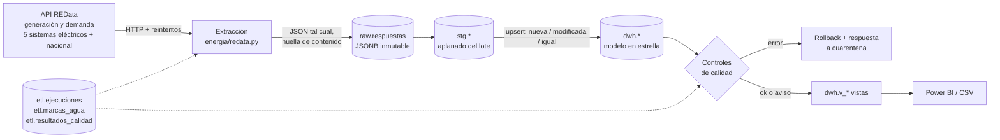
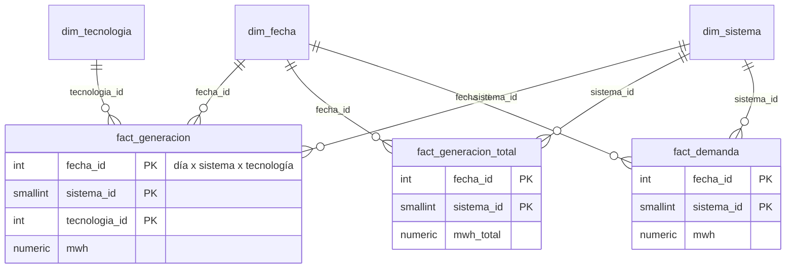

# Energía España — pipeline ELT incremental (REData → PostgreSQL)

Pipeline en Python y SQL que descarga cada día la **generación eléctrica por tecnología** y la
**demanda** de España desde la API pública de Red Eléctrica (REData), la carga de forma
**incremental** en PostgreSQL y la deja en un **modelo en estrella** listo para Power BI, con
**controles de calidad** y **tests** (incluidos tests de integración con una base de datos real).

[](../../actions/workflows/ci.yml)

> Proyecto personal de portfolio. Los datos son públicos; no hay datos de ninguna empresa.

## Qué demuestra

| Habilidad | Dónde verlo |
|---|---|
| ELT por capas (raw → staging → modelo) | [`sql/`](sql), [`energia/pipeline.py`](energia/pipeline.py) |
| Carga incremental con marca de agua y ventana de solape (recoge revisiones de la fuente) | `planificar()` en `pipeline.py`, tabla `etl.marcas_agua` |
| Idempotencia: ejecutar dos veces no duplica ni cambia nada | `tests/test_pipeline_integracion.py` |
| Modelado dimensional (2 hechos, dimensiones conformadas) | [`sql/003_dwh.sql`](sql/003_dwh.sql) |
| Calidad de datos como código, con severidad (error bloquea / aviso informa) | [`sql/calidad/`](sql/calidad) |
| Consumo de una API real con sus rarezas (límites, errores ambiguos, series intermitentes) | [`energia/redata.py`](energia/redata.py), «Notas sobre la fuente» |
| Tests con PostgreSQL real, fixtures reales y CI | [`tests/`](tests), [`.github/workflows/`](.github/workflows) |
| Capa de consumo para BI | [`sql/004_vistas.sql`](sql/004_vistas.sql), [`docs/powerbi.md`](docs/powerbi.md) |

## Arquitectura



**Por qué ELT y por qué tres capas**

- **raw** guarda la respuesta de la API sin tocar (JSONB), con una huella calculada solo sobre los
  datos (los metadatos `last-update` cambian a diario y no cuentan). Si mañana descubro un error en
  mi transformación, **reprocesar** no exige volver a llamar a la API.
- **stg** aplana el lote actual; es `UNLOGGED` porque se reconstruye siempre desde raw.
- **dwh** es el modelo para analizar. La transformación y los controles de calidad se hacen en **una
  sola transacción**: si un control de severidad *error* falla, no queda nada a medias en el modelo y
  la respuesta que lo causó pasa a *cuarentena*.

### Modelo



Grano: **un día × un sistema eléctrico (× una tecnología)**. Hay un hecho de generación por
tecnología, uno con el total que reporta la fuente y uno de demanda; los tres comparten las
dimensiones fecha y sistema.

## Resultados de una ejecución real (7 de octubre de 2026)

| | Carga inicial | Incremental (día siguiente) |
|---|---|---|
| Rango pedido | 2023-01-01 → 2026-10-06 | 2026-09-30 → 2026-10-06 (7 días de solape) |
| Peticiones a la API | 44 | 11 |
| Filas en staging | 81.270 | 369 |
| Hechos nuevos / modificados / sin cambios | 59.279 / 0 / 0 | 0 / 0 / 264 |
| Duración | 258,8 s | 7,9 s |

- El modelo contiene 1.375 días × 5 sistemas: 45.529 filas de generación por tecnología, 6.875 de
  total y 6.875 de demanda.
- La carga inicial está dominada por la **latencia de la API** (44 peticiones), no por SQL: la parte
  de transformación de 81.000 filas tarda unos 11 s.
- La segunda ejecución no cambia nada (0 nuevos, 0 modificados): es la prueba práctica de la
  idempotencia.
- Los 11 controles de calidad pasan. En la carga inicial saltaron dos **avisos** legítimos:
  4 valores ligeramente negativos de Carbón (generación neta) y 123 puntos que la API devuelve fuera
  del rango pedido (ver más abajo).

## Cómo ejecutarlo

Requisitos: Python 3.11+ y PostgreSQL 16 (o Docker).

```bash
git clone <este-repositorio> && cd energia-espana-pipeline
python -m venv .venv && source .venv/bin/activate      # en Windows: .venv\Scripts\activate
pip install -r requirements-dev.txt

docker compose up -d            # PostgreSQL en el puerto 5433 (bases energia y energia_test)
cp .env.example .env

python -m energia init-db       # crea esquemas, tablas y vistas (idempotente)
python -m energia run           # primera vez: desde ENERGIA_FECHA_INICIO (2023-01-01), ~4-5 min
python -m energia calidad       # controles de calidad
python -m energia resumen       # últimas ejecuciones, marcas de agua, controles
python -m energia exportar --destino export     # CSV del modelo (para Power BI sin PostgreSQL)
```

Con `make`: `make db init run calidad test lint`.

| Comando | Qué hace |
|---|---|
| `run [--desde F] [--hasta F] [--solape-dias N]` | Extrae, carga y transforma. Por defecto continúa desde la marca de agua menos el solape, hasta ayer |
| `reprocesar` | Devuelve a «pendiente» las respuestas en cuarentena y las vuelve a procesar (tras corregir un control o la transformación) |
| `calidad` | Ejecuta los controles; termina con código ≠ 0 si falla alguno de severidad *error* |

## Decisiones de diseño

- **Marca de agua por (conjunto de datos, sistema) + solape de 7 días.** La fuente revisa datos
  recientes; pedir de nuevo la última semana permite detectar esas revisiones. Los hechos se
  clasifican como *nueva / modificada / igual* antes de hacer upsert, y así se puede contar cuántos
  cambian realmente.
- **Huella de contenido sin metadatos.** Evita guardar en raw la misma respuesta cada día.
- **Controles de calidad en SQL, con metadatos en la cabecera** (`-- severidad: error|aviso`). Añadir un
  control es añadir un fichero. Los de severidad *error* protegen el modelo; los de *aviso* solo
  informan, para que un dato raro de la fuente no pare el pipeline para siempre.
- **El nacional no es un hecho.** La fuente publica además un total nacional. Lo guardo aparte
  (`dwh.ref_nacional`) solo para **conciliar**: comprobar que la suma de los cinco sistemas coincide con
  él. Mezclarlo con los sistemas duplicaría la generación al agregar.
- **`mwh` puede ser negativo en generación.** Es generación *neta*; el Carbón llega a −94,5 MWh algún
  día. Un `CHECK (mwh >= 0)` habría roto la carga con datos válidos. Se distingue entre negativos
  menores (aviso) y extremos (error, p. ej. un cambio de signo o de unidades).
- **Tests sin red, con datos reales.** Los fixtures son respuestas reales de la API recortadas por el
  falso cliente igual que lo haría la fuente. Un test aparte (`pytest -m live`) comprueba cada día que
  la API real sigue cumpliendo las premisas.

## Notas sobre la fuente

Descubiertas al probar la API real, y recogidas en el código y en los tests:

1. **Límite de rango.** Con `time_trunc=day` se aceptan rangos de algo más de un año (200 con 367
   días; 400 desde 369). El pipeline trocea en tramos de 365 días para no depender del margen exacto.
2. **Un 400 ambiguo.** Rango demasiado largo, fechas invertidas o formato inválido devuelven siempre el
   mismo 400 («datos no disponibles… inténtelo más tarde»). Como no es transitorio, **no se reintenta**;
   solo se reintentan fallos de red, 429 y 5xx, con espera exponencial.
3. **Puntos fuera del rango pedido.** A veces llega un punto del día siguiente al fin pedido o del día
   parcial en curso. Se filtra por la ventana pedida en staging y un control de aviso lo cuenta.
4. **Series que aparecen y desaparecen.** Una tecnología ausente un día no significa 0, así que no se
   rellena.
5. **El total coincide exactamente** con la suma de tecnologías y el nacional con la suma de sistemas;
   por eso esas comprobaciones son de severidad *error*.
6. **Horario.** Los datetimes llevan desfase; las fechas se calculan en `Europe/Madrid`, por lo que los
   días de cambio de hora (23 y 25 horas) no desplazan el día. Hay un fixture de una semana con cambio de
   hora para probarlo.

## Tests

```bash
pytest -q          # 67 tests: 44 unitarios + 23 de integración con PostgreSQL real
pytest -m live     # 4 pruebas de contrato contra la API real (las ejecuta el workflow diario)
```

Los de integración cubren, entre otros: idempotencia, revisión de un dato histórico, cuarentena y
reprocesado, respuesta repetida, datos corruptos que hacen rollback sin dejar rastro en el modelo,
puntos fuera de rango, series ausentes y el cambio de hora.

## Limitaciones y siguientes pasos

- La base de datos del workflow diario es efímera: sirve para demostrar la ejecución automática y
  publicar el CSV, no como almacén persistente.
- Solo granularidad diaria. La API admite granularidad horaria; añadiría una `dim_hora` y mucho más
  volumen.
- Se podría añadir el mix de importaciones/exportaciones o los precios del mercado.
- Sin orquestador (Airflow, Dagster…): el CLI se programa con cron/Actions. Es una decisión consciente
  para el tamaño del problema.
- GitHub desactiva los workflows programados tras 60 días sin actividad en el repo.

## Qué he aprendido

_(Pendiente: lo escribo yo, con mis palabras.)_

## Licencia y fuente de los datos

Código bajo licencia MIT. Datos: Red Eléctrica de España, [REData](https://www.ree.es/es/apidatos);
consulta sus condiciones de uso antes de reutilizarlos.
